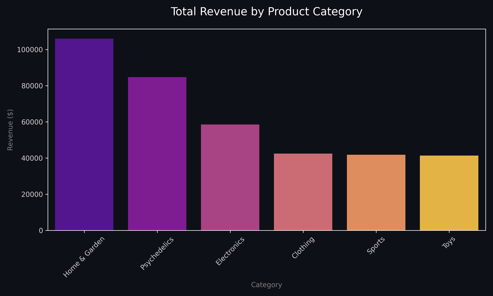
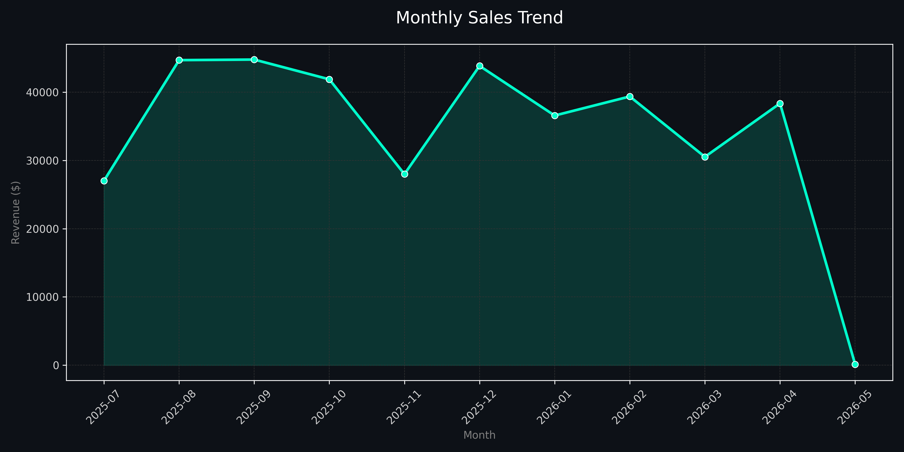

<div align="center">

# 🌌 E-Commerce Analytics: From Raw Data to Real Decisions

**by Emilio Morillo**

<br>


</div>

<br>


## A little context

I built this project for a simple reason: I got tired of seeing portfolios that only show *how* to do SQL, not *why* any of it matters.

So I asked myself: what if I treated a fake e-commerce database like it was a real client? What questions would an actual business owner lose sleep over? That's the angle I worked from. Every query here exists because a real version of that question exists somewhere on a Slack channel or a Friday afternoon call.

---


## What's in here

Three scripts, one database, one notebook. Nothing bloated.

- **`setup_db.py`**: Spins up a SQLite database from scratch and fills it with synthetic but realistic data. 100 customers, 50 products, 500 orders. Run it once and you're done.
- **`queries.sql`**: Five SQL queries that go beyond `SELECT *`. We're talking CTEs, window functions, month-over-month growth calculations, and a churn detection query that actually tells you who's gone quiet.
- **`eda.ipynb`**: A Jupyter notebook where the data starts talking. Charts, trends, category breakdowns, all rendered in dark mode because I think data should look as good as it performs.

---

## 📊 What the data says

<div align="center">
  
  <br><br>
  
</div>

Some things surprised me when I actually ran this. *Home & Garden* eating *Electronics* for breakfast wasn't something I anticipated. That kind of thing only shows up when you stop assuming and start looking.

---

## The five questions I answered

1. **Where is the money coming from, geographically?** Revenue ranked by country with a window function so you can see the gap between first and second at a glance.

2. **Who are the customers worth keeping?** A CLV (Customer Lifetime Value) ranking. The top 10 tell you a lot about what good looks like.

3. **Is the business growing or just surviving?** Monthly trend with MoM growth rates. Flat lines and big dips are visible immediately.

4. **What categories are people actually buying?** Simple but powerful. Turns out category intuition is usually wrong.

5. **Who hasn't been back in six months?** An anti-join that surfaces dormant customers. The first step to a re-engagement campaign.

---

## Run it yourself

```bash
git clone https://github.com/MgnumX/portfolio_data_project.git
cd portfolio_data_project

python setup_db.py        # builds the database
python generate_visuals.py # exports the charts
# open eda.ipynb in Jupyter or VS Code for the full walkthrough
```

No special environment needed. Just Python 3 and `pip install pandas matplotlib seaborn`.

---

## Una nota personal

Este proyecto lo hice desde cero, sin templates, sin copiar nada de Stack Overflow. Solo yo, Python, y demasiado café.

Soy de los que creen que el análisis de datos no es solo una habilidad técnica, es una forma de hacerle preguntas al mundo. Y el mundo, si le preguntas bien, siempre responde.

Si llegaste hasta acá y algo de esto te sirvió, me alegra. Si tienes feedback, abre un issue. Si quieres hablar de datos, SQL o lo que sea, ya sabes dónde encontrarme.

---

<div align="center">
  <p><i>"Los números no mienten. Solo se quedan callados hasta que haces la pregunta correcta."</i></p>
  <b>Emilio Morillo</b>
</div>
